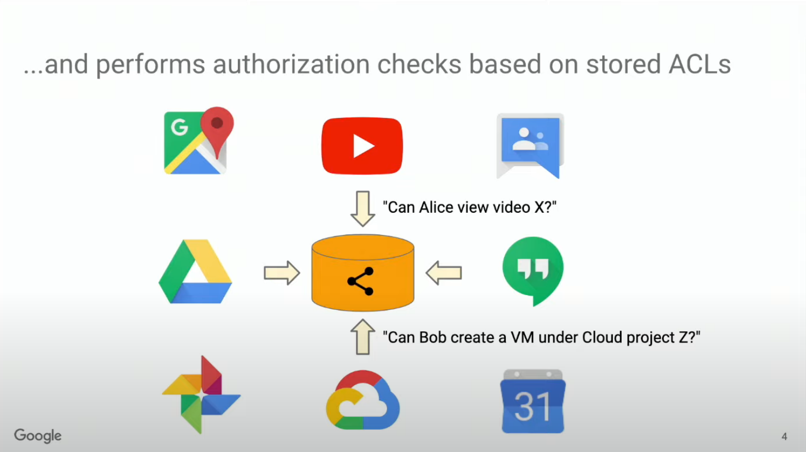

用户的权限管理对每个项目来说都至关重要。不同的业务场景决定了不同的权限管理需求，不同的技术栈也有不同的解决方案：如果你在写一个Ruby On Rails应用，那你可能会选择[cancan](https://github.com/ryanb/cancan)， 如果你正在使用K8S，那你很可能需要与K8S的[RBAC](https://kubernetes.io/docs/reference/access-authn-authz/rbac/)系统打交道。那如果你面对一个非常复杂的业务，需要实现极为灵活的权限配置，并且同时对接多个服务怎么办呢？谷歌的一致性全球授权系统[Zanzibar](https://research.google/pubs/pub48190/)以及其开源实现[Ory/Keto](https://github.com/ory/keto)或许可以帮到你。

# Zanzibar

## 简介

Google Zanzibar是谷歌2016年起上线的一致性全球授权系统。这套系统的主要功能是
1. 储存来自各个服务的访问控制列表(Access Control Lists, ACLs)，也就是所谓的权限(Permission)。
2. 根据储存的ACL，进行权限校验。

这套系统上线后对接的服务有谷歌地图，谷歌图片，谷歌云盘，GCP，以及Youtube等等重要的服务

为了服务如此重要的业务，Zanzibar有着以下特点：
1. 一致性：面对并发度如此大的业务场景，Zanzibar在检查权限的同时必须保证按照各个ACL的添加顺序判断。比如A添加了一条规则后立即删除，这两个动作如果没有按照正确的顺序执行，那么会造成权限泄露。
2. 灵活性：各个业务场景的鉴权需求都不尽相同，所以Zanzibar灵活地支持不同的权限模式
3. 横向扩展：以横向扩展支持数万亿条规则，每秒百万级鉴权
4. 性能：95%的请求10毫秒内完成，99%的请求100毫秒内完成
5. 可用性上线三年99.999%可用是时间

以上的各个特性中除了灵活性之外都是性能或算法上的特点，如果有兴趣可以阅读以下这篇论文：[Zanzibar: Google’s Consistent, Global Authorization System](https://research.google/pubs/pub48190/)。下面我们就灵活性这一特点看一下Zanzibar是如何定义鉴权模型的

## 概念与定义
### 关系元组(Relation Tuples)

Relation Tuples是Zanzibar的核心概念，一条Relation Tuples就对应了一条ACL。关系元组由命名空间(Namespace)，对象(Object)，关系(Relation)和主体(Subject)组成。一条Relation Tuples可以用[BNF语法](https://en.wikipedia.org/wiki/Backus%E2%80%93Naur_form)这样描述：
```bnf
<relation-tuple> ::= <object>'#'relation'@'<subject>
<object> ::= namespace':'object_id
<subject> ::= subject_id | <subject_set>
<subject_set> ::= <object>'#'relation
```
一条Relation Tuples写作
```
namespace:object#relation@subject
```
意味着`subject`对`namespace`中的`object`有一种`relation`。

换成更有语义的例子：
```
videos:cat.mp4#view@felix
```
就意味着`felix`对`videos`中的`cat.mp4`有`view`的关系。

上述BNF定义的第四条`subject_set`是由`<object>'#'relation`组成的，也就是代表了一群对某种`object`有`relation`的`subject`。举例来说就是
```
groups:admin#member@felix
groups:admin#member@john
videos:cat.mp4#view@(groups:admin#member)
```
在这个例子中，`felix`和`john`都对`groups:admin`有`member`的关系，而对`groups:admin`有`member`的关系的`subject_set`对`videos:cat.mp4`有`view`的关系。也就是说`felix`和`john`都对`videos:cat.mp4`有`view`的关系。这种嵌套的语法可以有很多层，从而达到了整个ACL规则灵活可配的目的。

### 命名空间(Namespaces)， 对象(Object)与主体(Subject)
Zanzibar中的Namespace并不是起隔离作用的，就像上面的那个例子，在编写`videos`Namespace时也可以引用`groups`Namespace。这里的命名空间概念更多是用来将数据分为同质的分块（并应用不同的配置），并且在储存层面上也是分离的。所以在多租户的使用场景中，用租户的UUID作为Namespace并不是一个好的选择，而应该使用`tenants`作为Namespace，从而实现
```
tenants:tenant-id-1#member@felix
tenants:tenant-id-1#member@john
```
这样的Relation Tuples，并且用`tenants:tenant-id-1#member`作为鉴权的`subject_set`。在命名方面，一般建议**Namespace使用单词的复数形式，而Object和Subject使用UUID**。
将Relation Tuples转换为图有助于更好地理解object与subject之间的关系，考虑[Keto官方文档](https://www.ory.sh/keto/docs/concepts/graph-of-relations)上的以下例子
```java
// user1 has access on dir1
dir1#access@user1
// Have a look on the subjects concept page if you don't know the empty relation.
dir1#parent@(file1#)
// Everyone with access to dir1 has access to file1. This would probably be defined
// through a subject set rewrite that defines this inherited relation globally.
// In this example, we define this tuple explicitly.
file1#access@(dir1#access)
// Direct access on file2 was granted.
file2#access@user1
// user2 is owner of file2
file2#owner@user2
// Owners of file2 have access to it; possibly defined through subject set rewrites.
file2#access@(file2#owner)
```
将其转换为图可以得到:

<svg id="mermaid-" width="100%" xmlns="http://www.w3.org/2000/svg" xmlns:xlink="http://www.w3.org/1999/xlink" height="603" style="max-width: 454.96875px;" viewBox="0 0 454.96875 603"><style>#mermaid-{font-family:"trebuchet ms",verdana,arial,sans-serif;font-size:16px;fill:#000000;}#mermaid- .error-icon{fill:#552222;}#mermaid- .error-text{fill:#552222;stroke:#552222;}#mermaid- .edge-thickness-normal{stroke-width:2px;}#mermaid- .edge-thickness-thick{stroke-width:3.5px;}#mermaid- .edge-pattern-solid{stroke-dasharray:0;}#mermaid- .edge-pattern-dashed{stroke-dasharray:3;}#mermaid- .edge-pattern-dotted{stroke-dasharray:2;}#mermaid- .marker{fill:#666;stroke:#666;}#mermaid- .marker.cross{stroke:#666;}#mermaid- svg{font-family:"trebuchet ms",verdana,arial,sans-serif;font-size:16px;}#mermaid- .label{font-family:"trebuchet ms",verdana,arial,sans-serif;color:#000000;}#mermaid- .cluster-label text{fill:#333;}#mermaid- .cluster-label span{color:#333;}#mermaid- .label text,#mermaid- span{fill:#000000;color:#000000;}#mermaid- .node rect,#mermaid- .node circle,#mermaid- .node ellipse,#mermaid- .node polygon,#mermaid- .node path{fill:#eee;stroke:#999;stroke-width:1px;}#mermaid- .node .label{text-align:center;}#mermaid- .node.clickable{cursor:pointer;}#mermaid- .arrowheadPath{fill:#333333;}#mermaid- .edgePath .path{stroke:#666;stroke-width:1.5px;}#mermaid- .flowchart-link{stroke:#666;fill:none;}#mermaid- .edgeLabel{background-color:white;text-align:center;}#mermaid- .edgeLabel rect{opacity:0.5;background-color:white;fill:white;}#mermaid- .cluster rect{fill:hsl(210,66.6666666667%,95%);stroke:#26a;stroke-width:1px;}#mermaid- .cluster text{fill:#333;}#mermaid- .cluster span{color:#333;}#mermaid- div.mermaidTooltip{position:absolute;text-align:center;max-width:200px;padding:2px;font-family:"trebuchet ms",verdana,arial,sans-serif;font-size:12px;background:hsl(-160,0%,93.3333333333%);border:1px solid #26a;border-radius:2px;pointer-events:none;z-index:100;}#mermaid-:root{--mermaid-font-family:"trebuchet ms",verdana,arial,sans-serif;}#mermaid- flowchart{fill:apa;}</style><g><g class="output"><g class="clusters"><g class="cluster" id="flowchart-subjID-166" transform="translate(227.71875,539.5)" style="opacity: 1;"><rect width="400.7421875" height="111" x="-200.37109375" y="-55.5"></rect><g class="label" transform="translate(0, -41.5)" id="mermaid-Text"><g transform="translate(-61.3671875,-13)"><foreignObject width="122.734375" height="26"><div xmlns="http://www.w3.org/1999/xhtml" style="display: inline-block; white-space: nowrap;">Subject ID region</div></foreignObject></g></g></g><g class="cluster" id="flowchart-obj-167" style="opacity: 1;" transform="translate(220.951171875,132)"><rect width="396.88671875" height="248" x="-198.443359375" y="-124"></rect><g class="label" transform="translate(0, -110)" id="mermaid-Text"><g transform="translate(-47.5859375,-13)"><foreignObject width="95.171875" height="26"><div xmlns="http://www.w3.org/1999/xhtml" style="display: inline-block; white-space: nowrap;">Object region</div></foreignObject></g></g></g></g><g class="edgePaths"><g class="edgePath LS-E LE-A" id="L-E-A" style="opacity: 1;"><path class="path" d="M105.48999201642336,86.5L99.9395766803528,94.08333333333333C94.38916134428223,101.66666666666667,83.28833067214111,116.83333333333333,77.73791533607056,132C72.1875,147.16666666666666,72.1875,162.33333333333334,72.1875,169.91666666666666L72.1875,177.5" marker-end="url(#arrowhead325)" style="fill:none"></path><defs><marker id="arrowhead325" viewBox="0 0 10 10" refX="9" refY="5" markerUnits="strokeWidth" markerWidth="8" markerHeight="6" orient="auto"><path d="M 0 0 L 10 5 L 0 10 z" class="arrowheadPath" style="stroke-width: 1; stroke-dasharray: 1, 0;"></path></marker></defs></g><g class="edgePath LS-A LE-B" style="opacity: 1;" id="L-A-B"><path class="path" d="M72.1875,223.5L72.1875,228.91666666666666C72.1875,234.33333333333334,72.1875,245.16666666666666,72.1875,258.1666666666667C72.1875,271.1666666666667,72.1875,286.3333333333333,72.27083333333333,301.5833333333333C72.35416666666667,316.8333333333333,72.52083333333333,332.1666666666667,72.60416666666667,339.8333333333333L72.6875,347.5" marker-end="url(#arrowhead326)" style="fill:none"></path><defs><marker id="arrowhead326" viewBox="0 0 10 10" refX="9" refY="5" markerUnits="strokeWidth" markerWidth="8" markerHeight="6" orient="auto"><path d="M 0 0 L 10 5 L 0 10 z" class="arrowheadPath" style="stroke-width: 1; stroke-dasharray: 1, 0;"></path></marker></defs></g><g class="edgePath LS-B LE-F" style="opacity: 1;" id="L-B-F"><path class="path" d="M72.6875,393.5L72.60416666666667,401C72.52083333333333,408.5,72.35416666666667,423.5,72.27083333333333,438.5833333333333C72.1875,453.6666666666667,72.1875,468.8333333333333,81.09114583333333,481.95726757766874C89.99479166666667,495.0812018220042,107.80208333333333,506.1624036440084,116.70572916666667,511.70300455501047L125.609375,517.2436054660126" marker-end="url(#arrowhead327)" style="fill:none;stroke-width:2px;stroke-dasharray:3;"></path><defs><marker id="arrowhead327" viewBox="0 0 10 10" refX="9" refY="5" markerUnits="strokeWidth" markerWidth="8" markerHeight="6" orient="auto"><path d="M 0 0 L 10 5 L 0 10 z" class="arrowheadPath" style="stroke-width: 1; stroke-dasharray: 1, 0;"></path></marker></defs></g><g class="edgePath LS-E LE-F" style="opacity: 1;" id="L-E-F"><path class="path" d="M135.43615989963504,86.5L139.75929991636255,94.08333333333333C144.08243993309003,101.66666666666667,152.72871996654501,116.83333333333333,157.05185998327252,135.83333333333334C161.375,154.83333333333334,161.375,177.66666666666666,161.375,198.33333333333334C161.375,219,161.375,237.5,161.375,254.33333333333334C161.375,271.1666666666667,161.375,286.3333333333333,161.375,305.3333333333333C161.375,324.3333333333333,161.375,347.1666666666667,161.375,370C161.375,392.8333333333333,161.375,415.6666666666667,161.375,434.6666666666667C161.375,453.6666666666667,161.375,468.8333333333333,161.375,481.8333333333333C161.375,494.8333333333333,161.375,505.6666666666667,161.375,511.0833333333333L161.375,516.5" marker-end="url(#arrowhead328)" style="fill:none"></path><defs><marker id="arrowhead328" viewBox="0 0 10 10" refX="9" refY="5" markerUnits="strokeWidth" markerWidth="8" markerHeight="6" orient="auto"><path d="M 0 0 L 10 5 L 0 10 z" class="arrowheadPath" style="stroke-width: 1; stroke-dasharray: 1, 0;"></path></marker></defs></g><g class="edgePath LS-G LE-F" style="opacity: 1;" id="L-G-F"><path class="path" d="M253.82421875,220.11233849767885L246.29752604166666,226.0936154147324C238.77083333333334,232.0748923317859,223.71744791666666,244.03744616589293,216.19075520833334,257.6020564162798C208.6640625,271.1666666666667,208.6640625,286.3333333333333,208.6640625,305.3333333333333C208.6640625,324.3333333333333,208.6640625,347.1666666666667,208.6640625,370C208.6640625,392.8333333333333,208.6640625,415.6666666666667,208.6640625,434.6666666666667C208.6640625,453.6666666666667,208.6640625,468.8333333333333,204.04876360735736,481.8333333333333C199.4334647147147,494.8333333333333,190.20286692942943,505.6666666666667,185.5875680367868,511.0833333333333L180.97226914414415,516.5" marker-end="url(#arrowhead329)" style="fill:none"></path><defs><marker id="arrowhead329" viewBox="0 0 10 10" refX="9" refY="5" markerUnits="strokeWidth" markerWidth="8" markerHeight="6" orient="auto"><path d="M 0 0 L 10 5 L 0 10 z" class="arrowheadPath" style="stroke-width: 1; stroke-dasharray: 1, 0;"></path></marker></defs></g><g class="edgePath LS-G LE-C" style="opacity: 1;" id="L-G-C"><path class="path" d="M277.19752956081084,223.5L276.88986838400905,228.91666666666666C276.5822072072072,234.33333333333334,275.96688485360363,245.16666666666666,275.6592236768018,258.1666666666667C275.3515625,271.1666666666667,275.3515625,286.3333333333333,275.3515625,305.3333333333333C275.3515625,324.3333333333333,275.3515625,347.1666666666667,275.3515625,370C275.3515625,392.8333333333333,275.3515625,415.6666666666667,275.3515625,434.6666666666667C275.3515625,453.6666666666667,275.3515625,468.8333333333333,280.9882050018769,481.8333333333333C286.62484750375376,494.8333333333333,297.8981325075075,505.6666666666667,303.5347750093844,511.0833333333333L309.17141751126127,516.5" marker-end="url(#arrowhead330)" style="fill:none"></path><defs><marker id="arrowhead330" viewBox="0 0 10 10" refX="9" refY="5" markerUnits="strokeWidth" markerWidth="8" markerHeight="6" orient="auto"><path d="M 0 0 L 10 5 L 0 10 z" class="arrowheadPath" style="stroke-width: 1; stroke-dasharray: 1, 0;"></path></marker></defs></g><g class="edgePath LS-G LE-H" style="opacity: 1;" id="L-G-H"><path class="path" d="M303.18359375,213.41572433607132L316.7454427083333,220.5131036133928C330.3072916666667,227.61048289071422,357.4309895833333,241.8052414453571,370.9928385416667,256.4859540560119C384.5546875,271.1666666666667,384.5546875,286.3333333333333,384.6380208333333,301.5833333333333C384.7213541666667,316.8333333333333,384.8880208333333,332.1666666666667,384.9713541666667,339.8333333333333L385.0546875,347.5" marker-end="url(#arrowhead331)" style="fill:none"></path><defs><marker id="arrowhead331" viewBox="0 0 10 10" refX="9" refY="5" markerUnits="strokeWidth" markerWidth="8" markerHeight="6" orient="auto"><path d="M 0 0 L 10 5 L 0 10 z" class="arrowheadPath" style="stroke-width: 1; stroke-dasharray: 1, 0;"></path></marker></defs></g><g class="edgePath LS-H LE-C" style="opacity: 1;" id="L-H-C"><path class="path" d="M385.0546875,393.5L384.9713541666667,401C384.8880208333333,408.5,384.7213541666667,423.5,384.6380208333333,438.5833333333333C384.5546875,453.6666666666667,384.5546875,468.8333333333333,379.5333673517268,481.8333333333333C374.51204720345345,494.8333333333333,364.4694069069069,505.6666666666667,359.4480867586337,511.0833333333333L354.42676661036035,516.5" marker-end="url(#arrowhead332)" style="fill:none;stroke-width:2px;stroke-dasharray:3;"></path><defs><marker id="arrowhead332" viewBox="0 0 10 10" refX="9" refY="5" markerUnits="strokeWidth" markerWidth="8" markerHeight="6" orient="auto"><path d="M 0 0 L 10 5 L 0 10 z" class="arrowheadPath" style="stroke-width: 1; stroke-dasharray: 1, 0;"></path></marker></defs></g></g><g class="edgeLabels"><g class="edgeLabel" transform="translate(72.1875,132)" style="opacity: 1;"><g transform="translate(-22.6875,-13)" class="label"><rect rx="0" ry="0" width="45.375" height="26"></rect><foreignObject width="45.375" height="26"><div xmlns="http://www.w3.org/1999/xhtml" style="display: inline-block; white-space: nowrap;"><span id="L-L-E-A" class="edgeLabel L-LS-E' L-LE-A">parent</span></div></foreignObject></g></g><g class="edgeLabel" style="opacity: 1;" transform="translate(72.1875,301.5)"><g transform="translate(-24.8984375,-13)" class="label"><rect rx="0" ry="0" width="49.796875" height="26"></rect><foreignObject width="49.796875" height="26"><div xmlns="http://www.w3.org/1999/xhtml" style="display: inline-block; white-space: nowrap;"><span id="L-L-A-B" class="edgeLabel L-LS-A' L-LE-B">access</span></div></foreignObject></g></g><g class="edgeLabel" style="opacity: 1;" transform="translate(72.1875,438.5)"><g transform="translate(-44.0234375,-13)" class="label"><rect rx="0" ry="0" width="88.046875" height="26"></rect><foreignObject width="88.046875" height="26"><div xmlns="http://www.w3.org/1999/xhtml" style="display: inline-block; white-space: nowrap;"><span id="L-L-B-F" class="edgeLabel L-LS-B' L-LE-F">file1#access</span></div></foreignObject></g></g><g class="edgeLabel" style="opacity: 1;" transform="translate(161.375,301.5)"><g transform="translate(-24.8984375,-13)" class="label"><rect rx="0" ry="0" width="49.796875" height="26"></rect><foreignObject width="49.796875" height="26"><div xmlns="http://www.w3.org/1999/xhtml" style="display: inline-block; white-space: nowrap;"><span id="L-L-E-F" class="edgeLabel L-LS-E' L-LE-F">access</span></div></foreignObject></g></g><g class="edgeLabel" style="opacity: 1;" transform="translate(208.6640625,370)"><g transform="translate(-24.8984375,-13)" class="label"><rect rx="0" ry="0" width="49.796875" height="26"></rect><foreignObject width="49.796875" height="26"><div xmlns="http://www.w3.org/1999/xhtml" style="display: inline-block; white-space: nowrap;"><span id="L-L-G-F" class="edgeLabel L-LS-G' L-LE-F">access</span></div></foreignObject></g></g><g class="edgeLabel" style="opacity: 1;" transform="translate(275.3515625,370)"><g transform="translate(-21.7890625,-13)" class="label"><rect rx="0" ry="0" width="43.578125" height="26"></rect><foreignObject width="43.578125" height="26"><div xmlns="http://www.w3.org/1999/xhtml" style="display: inline-block; white-space: nowrap;"><span id="L-L-G-C" class="edgeLabel L-LS-G' L-LE-C">owner</span></div></foreignObject></g></g><g class="edgeLabel" style="opacity: 1;" transform="translate(384.5546875,301.5)"><g transform="translate(-24.8984375,-13)" class="label"><rect rx="0" ry="0" width="49.796875" height="26"></rect><foreignObject width="49.796875" height="26"><div xmlns="http://www.w3.org/1999/xhtml" style="display: inline-block; white-space: nowrap;"><span id="L-L-G-H" class="edgeLabel L-LS-G' L-LE-H">access</span></div></foreignObject></g></g><g class="edgeLabel" style="opacity: 1;" transform="translate(384.5546875,438.5)"><g transform="translate(-44.0234375,-13)" class="label"><rect rx="0" ry="0" width="88.046875" height="26"></rect><foreignObject width="88.046875" height="26"><div xmlns="http://www.w3.org/1999/xhtml" style="display: inline-block; white-space: nowrap;"><span id="L-L-H-C" class="edgeLabel L-LS-H' L-LE-C">file2#access</span></div></foreignObject></g></g></g><g class="nodes"><g class="node default" id="flowchart-F-150" transform="translate(161.375,539.5)" style="opacity: 1;"><rect rx="23" ry="23" x="-35.765625" y="-23" width="71.53125" height="46" class="label-container"></rect><g class="label" transform="translate(0,0)"><g transform="translate(-20.015625,-13)"><foreignObject width="40.03125" height="26"><div xmlns="http://www.w3.org/1999/xhtml" style="display: inline-block; white-space: nowrap;">user1</div></foreignObject></g></g></g><g class="node default" style="opacity: 1;" id="flowchart-C-151" transform="translate(333.10546875,539.5)"><rect rx="23" ry="23" x="-35.765625" y="-23" width="71.53125" height="46" class="label-container"></rect><g class="label" transform="translate(0,0)"><g transform="translate(-20.015625,-13)"><foreignObject width="40.03125" height="26"><div xmlns="http://www.w3.org/1999/xhtml" style="display: inline-block; white-space: nowrap;">user2</div></foreignObject></g></g></g><g class="node default" style="opacity: 1;" id="flowchart-A-146" transform="translate(72.1875,200.5)"><rect rx="0" ry="0" x="-24.6796875" y="-23" width="49.359375" height="46" class="label-container"></rect><g class="label" transform="translate(0,0)"><g transform="translate(-14.6796875,-13)"><foreignObject width="29.359375" height="26"><div xmlns="http://www.w3.org/1999/xhtml" style="display: inline-block; white-space: nowrap;">file1</div></foreignObject></g></g></g><g class="node default" style="opacity: 1;" id="flowchart-E-147" transform="translate(122.32421875,63.5)"><rect rx="0" ry="0" x="-23.34375" y="-23" width="46.6875" height="46" class="label-container"></rect><g class="label" transform="translate(0,0)"><g transform="translate(-13.34375,-13)"><foreignObject width="26.6875" height="26"><div xmlns="http://www.w3.org/1999/xhtml" style="display: inline-block; white-space: nowrap;">dir1</div></foreignObject></g></g></g><g class="node default" style="opacity: 1;" id="flowchart-G-149" transform="translate(278.50390625,200.5)"><rect rx="0" ry="0" x="-24.6796875" y="-23" width="49.359375" height="46" class="label-container"></rect><g class="label" transform="translate(0,0)"><g transform="translate(-14.6796875,-13)"><foreignObject width="29.359375" height="26"><div xmlns="http://www.w3.org/1999/xhtml" style="display: inline-block; white-space: nowrap;">file2</div></foreignObject></g></g></g><g class="node default" style="opacity: 1;" id="flowchart-B-153" transform="translate(72.1875,370)"><polygon points="11.5,0 116.875,0 128.375,-23 116.875,-46 11.5,-46 0,-23" transform="translate(-64.1875,23)" class="label-container"></polygon><g class="label" transform="translate(0,0)"><g transform="translate(-42.6875,-13)"><foreignObject width="85.375" height="26"><div xmlns="http://www.w3.org/1999/xhtml" style="display: inline-block; white-space: nowrap;">dir1#access</div></foreignObject></g></g></g><g class="node default" style="opacity: 1;" id="flowchart-H-163" transform="translate(384.5546875,370)"><polygon points="11.5,0 113.328125,0 124.828125,-23 113.328125,-46 11.5,-46 0,-23" transform="translate(-62.4140625,23)" class="label-container"></polygon><g class="label" transform="translate(0,0)"><g transform="translate(-40.9140625,-13)"><foreignObject width="81.828125" height="26"><div xmlns="http://www.w3.org/1999/xhtml" style="display: inline-block; white-space: nowrap;">file2#owner</div></foreignObject></g></g></g></g></g></g></svg>

其中实线代表了直接定义的关系，而虚线代表了由`Subject Set`继承而来的关系。

# Keto

Ory/Keto是谷歌Zanzibar的第一个也是目前唯一一个开源实现。Keto用golang实现并兼容Zanzibar的概念，它作为一个单独的服务部署提供了RestfulAPI以及Grpc两种调用方式。后端存储使用了PostgreSQL/MySQL，官方并未公布其具体的性能表现，但比起使用[Spanner](https://research.google/pubs/pub39966/)的Zanzibar来说，性能应该是差一些的。

## 动手尝试

Keto提供了一个简单的例子来展示他是如何工作的
```bash
# clone the repository if you don't have it yet
git clone git@github.com:ory/keto.git && cd keto

docker-compose -f contrib/cat-videos-example/docker-compose.yml up
```
注意如果这里如果报出了以下错误
```bash
ERROR: The Compose file './contrib/cat-videos-example/docker-compose.yml' is invalid because:
services.keto.volumes contains an invalid type, it should be a string
services.keto-init.volumes contains an invalid type, it should be a string
```
那么你需要将`contrib/cat-videos-example/docker-compose.yml`这个文件的第一行改为`version: '3.2'`
这里的keto实例使用了内存储存，所以并不需要一个额外的数据库。
执行
```bash
docker-compose -f contrib/cat-videos-example/docker-compose.yml exec keto sh
```
进入到容器中后就可以使用keto的命令行工具了。这里默认装载了`contrib/cat-videos-example/relation-tuples`下的所有规则，在生产环境中可以像这样用keto命令行
直接装载relation tuples文件，也可以使用API动态添加/删除。执行
```bash
keto relation-tuple get videos
```
可以输出在`videos` namespace 下的所有规则
```
videos          /cats           owner           cat lady
videos          /cats           view            videos:/cats#owner
videos          /cats/1.mp4     owner           videos:/cats#owner
videos          /cats/1.mp4     view            *
videos          /cats/1.mp4     view            videos:/cats/1.mp4#owner
videos          /cats/2.mp4     owner           videos:/cats#owner
videos          /cats/2.mp4     view            videos:/cats/2.mp4#owner
```
检查所有人对`/cats/2.mp4`的访问权限：
```bash
keto check "*" view videos /cats/2.mp4
Denied
```
可以看到输出了拒绝访问, 而`cat lady`由于第1，6，7条规则，是可以访问的
```
keto check "cat lady" view videos /cats/2.mp4
Allowed
```
如果想搞明白`/cats/2.mp4`可以被谁访问，以及其原因，可以使用`expand`命令
```bash
keto expand view videos /cats/2.mp4
∪ videos:/cats/2.mp4#view
├─ ∪ videos:/cats/2.mp4#owner
│  ├─ ∪ videos:/cats#owner
│  │  ├─ ☘ cat lady️
```
输出的树中`∪`代表了`Subject Set`， 而`☘`代表了最终可以访问`Object`的`Subject`。

# 总结

Zanzibar及其开源实现Ory/Keto致力于实现一套灵活，弹性，可扩展，高可用的鉴权服务体系。Zanzibar在过去的几年中支持了几乎所有的谷歌云上服务，已经印证了它灵活性的价值，而谷歌这一套系统支持全球业务的运维能力也令人赞叹。而Keto也让我们使用这套理念治理自己项目的权限成为可能，但这不意味着Keto就是解决权限问题的银弹，部署一个单独的服务来做中央式权限管理对运维的要求相当高，并且不是每一个项目都需要如此灵活的权限管理。Zanzibar所提出的这套基于`Relation Tuple`的权限管理概念十分值得学习，它找到一个灵活性与复杂度的平衡点，使得相对简单的语法也能支持复杂多变的场景。

### 参考链接
1. https://research.google/pubs/pub48190/
2. https://www.youtube.com/watch?v=mstZT431AeQ
3. https://research.google/pubs/pub39966/
4. https://github.com/ory/keto
5. https://www.ory.sh/keto/
6. https://www.ory.sh/looking-at-keto/
