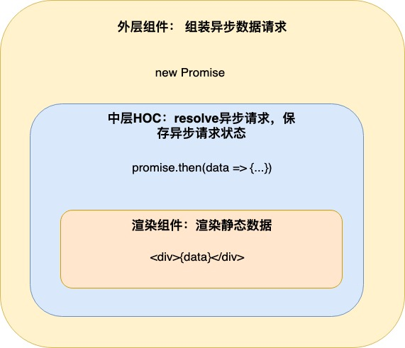

在React中，无论是否使用了Redux或其他状态管理框架，都无法避免在组件中处理异步请求。在不使用`React Hooks`的情况下，其典型的流程为：
- 在`componentDidMount`中发起异步请求
- 调用`setState`在state中维护请求的loading状态，并根据此状态渲染加载动画
- 在异步请求resolve的时候调用`setState`将数据放到state中，并将loading状态置为false
- 如果异步请求存在异常，则需要处理异常并渲染对应的异常状态

可以看到整个流程非常琐碎，如果项目中有很多异步组件，则每个组件都要重复地写一次以上流程。
同时，这个流程存在以下问题：
1. 如果组件`unmount`之后异步请求才resolve，那么很有可能收到`Warning: Can’t call setState (or forceUpdate) on an unmounted component. `警告
2. 在实现类似于`typeahead`类型的autocomplete组件或是其他的会频繁发生异步请求的组件中，有可能会发生请求先发后到的问题：先发的请求比后发的请求更慢resolve，导致最后一次渲染结果使用了之前已经过期的输入
3. 组件除自己的业务逻辑之外还需要维护整套异步请求流程。违反了函数式编程中`“纯”`的概念。一个优秀的纯组件应该仅有输入和输出：重复同一个输入应该幂等地返回同一个渲染结果

为了解决上述问题，我们将所有异步逻辑抽象到一个高阶组件（HOC）中，并保持真正渲染业务逻辑的组件足够`“纯”`，并且使用Typescript使props类型更为清晰。
我们把这个HOC叫做`withAsyncData`,源码可以在[这里](https://github.com/ChenNima/blog-example/blob/master/front-end/withAsyncData.tsx)看到。

经过包装后的组件总体结构如下图：

# 🔨 构建HOC

### **1. 初始状态**

```jsx
const WithAsyncData = Child => (
  class WithAsyncData extends Component {
    mounted = false;
    state = {
      isLoadingData: false
    }
  }
);
```
我们的HOC接受一个React Component作为参数，返回一个经过包裹的Component。初始我们拥有两个状态：mounted和isLoadingData。顾名思义他们是用来维护组件mount状态和数据loading状态的。由于mount状态并不直接影响渲染结果而只是用来指导是否应该调用`setState`，我们选择把它放在`this`上而不是`state`里。


### **2. 接受异步数据**
```jsx
static getDerivedStateFromProps(props, state) {
  // cleanData这个属性用来表示是否在每次更新数据之后将上次的数据保存在lastData这个state中，主要用于infinityScroll这种场景。
  const { data, cleanData } = props;
  const { lastData } = state;
  // 如果data没有改变，直接跳过
  if( data === lastData ) {
    return null;
  }
  // 如果data是同步数据，那么将isLoadingData置为false，直接将data传递给渲染组件
  if (!isThenable(data)) {
    return {
      lastData: data,
      data,
      dataPromise: null,
      isLoadingData: false
    };
  // 如果data是异步请求（这里用thenable表示），那么将isLoadingData置为true，准备请求异步数据
  } else {
    const newState = {
      lastData: data,
      dataPromise: data,
      isLoadingData: true
    };
    if(cleanData) {
      newState.data = null;
    }
    return newState;
  }
}
```
使用`getDerivedStateFromProps`钩子可以在每次渲染之前接收外部传进来的`data`，在这里`data`可以是一个同步数据，也可以是一个异步`Promise`。

### **3. 处理异步数据**

```jsx
componentDidMount() {
  // 记录组件mount状态
  this.mounted = true;
  if (this.state.dataPromise) {
    this.resolveAsyncData(this.state.dataPromise);
  }
}

componentDidUpdate(prevProps, prevState) {
  // 仅在dataPromise改变的情况下才resolve异步数据
  if (this.state.dataPromise && (this.state.dataPromise !== prevState.dataPromise)) {
    this.resolveAsyncData(this.state.dataPromise);
  }
}

shouldKeepResult(dataPromise) {
  // 仅仅在当前Promise是组件接收到的最后一个Promise，并且组件尚未unmount的情况下才会将data真正resolve给渲染组件
  return dataPromise === this.state.dataPromise && this.mounted;
}

async resolveAsyncData(dataPromise) {
  try {
    const data = await dataPromise;
    // 在此处闭包访问dataPromise，即可将resolve的Promise与组件最后接收到的Promise进行对比
    if (this.shouldKeepResult(dataPromise)) {
      if(this.props.onDataReady) {
        // 在数据resolve之后，外部组件的回调钩子
        this.props.onDataReady(data);
      }
      this.setState({
        data,
        isLoadingData: false,
        dataPromise: null,
        dataError: null
      });
    }
  } catch (error) {
    if (this.shouldKeepResult(dataPromise)) {
      if(this.props.onDataError) {
        // 在数据resolve 失败之后，外部组件的回调钩子
        this.props.onDataError(error);
      }
      this.setState({
        dataError: error,
        isLoadingData: false,
        dataPromise: null
      });
    }
  }
}
// 组件unmount之前记录状态
componentWillUnmount() {
  this.mounted = false;
}
```
### **4. 传递数据给子组件**

```jsx
render() {
  const props = {
    // 对子组件来说，data是同步数据。将外部传入的promise删除并替换为同步数据，同时将loading状态等state也一同传递
    ...omit(this.props, ['data']),
    ...this.state
  };
  return <Child {...props} />;
}
```

至此，我们完成了整个HOC的构建，实际使用时效果如下
```jsx
const promise = new Promise<string>(resolve => setTimeout(() => {resolve('hello world');}, 200));

const RenderComponent = withAsyncData(({ data, isLoadingData }: { data: string, isLoadingData?: boolean }) => (
  <div>
    {isLoadingData && <span>loading</span>}
    {!isLoadingData && data && <span>{data}</span>}
  </div>
));
const ParentComponent = () => (
  <RenderComponent data={promise} />
);
```

**可以看到，外层`ParentComponent`仅仅负责将异步数据传递给了子组件，而内部组件`RenderComponent`也仅仅是将静态内容渲染成了dom。整个异步数据的resolve和状态维持都放在了HOC内部。结构正如一开始的图所描述**

# 🚀 改写为Typescript

经过HOC包裹后的组件，由接收同步数据变为接收异步数据，其Props的type也发生了相应的改变。为了达到这一目的，我们将HOC进行以下改写：
```jsx
interface PropsType<T> {
  data: PromiseLike<T> | T | null;
  onDataReady?: (data: T) => void;
  onDataError?: (e: any) => void;
  cleanData?: boolean;
}

interface StateType<T> {
  dataPromise?: PromiseLike<T> | null;
  data?: T;
  lastData?: T;
  isLoadingData: boolean;
  dataError?: any;
}

function withAsyncData<ChildPropsType extends { data?: any }>(Child: ComponentType<ChildPropsType>) {
  // 真正的data type是由子组件决定的
  type Data = ChildPropsType['data'];
  // 将data type从子组件的props中删除， HOC接收的异步数据最终type为PromiseLike<Data>
  type MixedPropsType = Omit<ChildPropsType, 'data'> & PropsType<Data>;

  return class WithAsyncData extends Component<MixedPropsType, StateType<Data>> {
    ...
  }
```
- 使用泛型`<ChildPropsType extends { data?: any }>`以及自动类型判断来将要求子组件必须接受`data`属性
- `Omit<ChildPropsType, 'data'>`将data type从子组件的props中删除。在较新的typescript中`Omit`帮助类型的定义在`node_modules/typescript/lib/lib.es5.d.ts`中。如果typescript版本较旧没有该帮助类型，也可以自行polyfill：
```jsx
declare type Omit<T, K> = Pick<T, Exclude<keyof T, K>>;
```
如下图。如果我们使用错误的promise type，那么Typescript就会报错。


