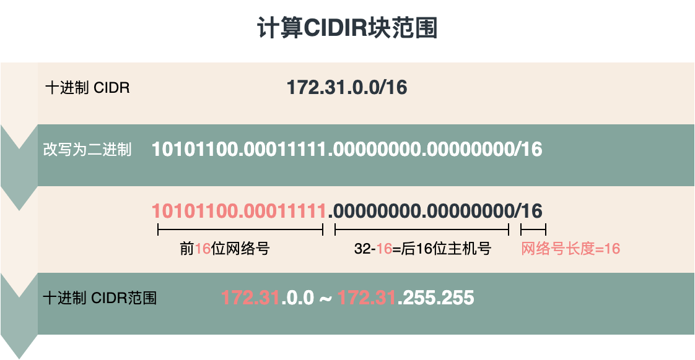
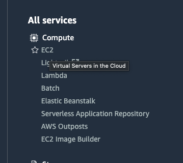
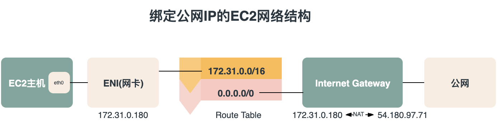

AWS([Amazon Web Services](https://aws.amazon.com/))是由亚马逊公司所创建的云计算平台，向个人、企业和政府提供一系列包括信息技术基础架构和应用的服务，如存储、数据库、计算、机器学习等等。使用AWS部署云服务可以免去传统私有服务期运维的各种麻烦，可以方便地快速上线业务。但在AWS上部署服务，网络结构搭建是绕不开的话题，很多同学刚接触AWS的时候就被一堆诸如VPC, Internet Gateway, Nat Gateway的概念绕晕了，最后在AWS的console中勉强拼凑出的服务也隐含着很多网络上的漏洞。

今天，我们就一起从零搭建一个完整的AWS网络架构并用它来支撑我们的服务，在接下来的几篇文章里，你将会看到我们一步一步地搭建出这样的一个结构：


**<center>图0-1 示例AWS网络结构</center>**

其中包括了：
- VPC
- Subnet
- Internet Gateway
- Nat Gateway
- ENI
- EIP
- VPC Endpoint
- Route Table
- Security Group
- ELB

等等组件，如果你觉得这个结构太复杂一时看不明白不要紧，接下来的几篇文章会一个模块一个模块地讲解并搭建起来。

搭建AWS架构的工具也非常多，你可以使用AWS提供的Web UI, CLI, [Cloudformation](https://aws.amazon.com/cn/cloudformation/)(infrastructure as code)或者Hashicrop提供的第三方infrastructure as code工具[Terraform](https://www.terraform.io/)。这里我们使用最直观的Web UI来做演示。

今天的第一节课，我们就来学习一个AWS网络中基本的基本的组件: `VPC`和`Internet Gateway`。

# 0. 问题：VPC中的EC2实例是如何与公网连接的

在文章的开始我们先来看一个问题，在VPC中部署的的EC2实例是如何与公网连接的？最简单的方式自然是给这台EC2实例直接绑定一个公网IP了，但有的时候为什么明明给EC2绑定了公网IP还是无法访问网络呢？进一步的，EC2中的网络流量是如何经由VPC中各个组件之后通过公网的IP访问到互联网的呢？接下来我们就从头搭建一套最简单的AWS网络结构并部署一台EC2实例试试看吧。

# 1. VPC

## 1.1 认识VPC
VPC([Amazon Virtual Private Cloud](https://aws.amazon.com/vpc/))字面意思是虚拟私有云，它是AWS上网络结构的基础，主要提供了网络上的逻辑隔离。在一个VPC内部可以在一定的IP范围内创建子网(Subnet)，网关(Gateway)和路由表(Route Table)。在AWS console中找到VPC服务页面


**<center>图1-1</center>**

可以看到每个region都会有一个默认的VPC，并且已经有了一些配置:


**<center>图1-2</center>**

这里可以看到这个默认的VPC已经配置好了CIDR block, DHCP, Route Table 和 ACL。我们来看看这些配置是做什么的：
- CIDR
前面提到了，在VPC内部可以在一定IP范围内创建子网以及其他一系列网络设施，这个“一定IP范围”就是指代CIDR包含的范围了。[CIDR](https://zh.wikipedia.org/wiki/%E6%97%A0%E7%B1%BB%E5%88%AB%E5%9F%9F%E9%97%B4%E8%B7%AF%E7%94%B1)(Classless Inter-Domain Routing)即无类别域间路由, 主要是依托于可变长子网掩码(VLSM)实现的动态划分主机和子网，用来替代已经被弃用的[分类网络](https://zh.wikipedia.org/wiki/%E5%88%86%E7%B1%BB%E7%BD%91%E7%BB%9C)。如图1-3，以这里的`172.31.0.0/16`为例, CIDR主要由两部分组成，斜杠前面的十进制IP地址和斜杠后面的前缀长度。该前缀长度`16`表示前半段的IP地址中，`前16位二进制为网络号，而其余位是主机号`。我们将IP地址转换为二进制得到`10101100.00011111.00000000.00000000`, 前16位正好匹配IP地址的前两段，所以在这个CIDR块中可以分配的地址为`172.31.0.0~172.31.255.255`。而斜杠后表示前N位为网络号的数字也不一定是0，8，16，24或者32，也可以是0~32的任意整数。需要注意的是这里的CIDR网络范围是`私有的ip地址`而不是公网ip。

**<center>图1-3</center>**
- DHCP
即Dynamic Host Configuration Protocol，该服务的主要目的是协助网络内的其他主机正确配置ip等网络配置，详细的内容可以参考鸟哥的[这篇文章](http://cn.linux.vbird.org/linux_server/0340dhcp.php#theory)
- Route Table
路由表，包含了对于一定ip范围内的请求的跳转规则，在之后的文章中会详细介绍。
- ACL
即Access Control List，顾名思义这是用来做请求白名单/黑名单设置的，之后会详细介绍。

很多同学在一开始使用AWS的时候可能会下意识地使用这个默认的VPC，但是今天让我们来新建一个VPC从零开始配置网络结构吧。

## 1.2 创建与配置VPC
在左侧导航栏找到`Your VPCs`选项，然后点击右上角的`Create VPC`就进入了创建VPC的页面，这个页面的内容很简单，让我们做如下配置：
- Name tag填写`test-vpc`给我们的新VPC起个名字
- IPv4 CIDR block填写和默认VPC一样的`172.31.0.0/16`，这里的CIDR对应的IP地址都是每个VPC的私有地址，所以不用担心相互冲突
- IPv6 CIDR block默认选择关闭，这里使用IPv4做演示

然后就可以点击右下角的Create VPC创建新的VPC了。创建完成之后就可以看到这个VPC也同时配置好了DHCP, Route Table和ACL。

现在，你已经拥有了一个含有`172.31.0.0/16`私网地址的VPC了，但是如果你现在兴冲冲地在这个VPC下面创建EC2实例，那么AWS会提醒你`A subnet is required when launching into a VPC`。因为虽然VPC仅仅是个隔离的容器，而真正可以分配私网ip地址的单位是子网(subnet)。

点选左侧导航栏的`Subnets`，然后选择右上角的Create Subnet按钮就进去了子网创建页面。这里的选项要比VPC创建还要简单
- VPC ID这里可以选择我们刚才创建好的`test-vpc`。选择好后就会出现剩余的选项
- Subnet name填写test-subnet-1
- Availability Zone 可用区你可以理解为一个region里不同的机房，你可以将不同的子网部署在不用的可用区中，如果其中一个可用区由于物理原因损毁了，那你的服务还可以迁移到未受影响的可用区。这里我们选择`No perference`让AWS自动帮我们选一个就好
- IPv4 CIDR block这是子网的CIDR块，我们填写`172.31.0.0/24`。可以看到这个CIDR和VPC的CIDR只有最后一位不同。这个24就意味着前24位二进制用作网络号，所以这个子网的ip分配空间为`172.31.0.0~172.31.0.255`
- 可以选Add new subnet在同一个VPC中添加数个子网，这里我们只创建一个

点选Create Subnet完成创建，创建完成后我们看到AWS将我们的子网分配至其中一个可用区，并自动将Route Table和ACL配置为与VPC相同。

现在让我们尝试在这个子网里创建一台EC2实例吧

新开一个浏览器tab，在AWS console中找到EC2


**<center>图1-4</center>**

然后在左侧导航栏找到`instance`选项卡，最后点击右上角的Launch Instances进入创建EC2页面。Image选择Ubuntu Server 20.04 LTS (HVM), SSD Volume Type - ami-007b7745d0725de95。实例类型选择t2.nano就足够了。然后点选`Next: Configure Instance Details`进入详细配置。
- Network 选择我们创建的vpc-test
- 由于只有一个subnet，AWS会帮我们自动选取Subnet
- Auto-assign Public IP不妨选择`enabled`让这台EC2分配到一个公网IP

然后就可以选择`Review and Launch`跳过存储和安全组的设置(注意这里的安全组配置会自动打开22端口访问以便于SSH连接)直接启动这台实例。点击Launch后AWS会提醒你为这台实例创建秘钥对以方便SSH登录，我们选择`Create a new key pair`创建一个新秘钥对，名字就叫`key-test`吧。点击Download key pair下载私钥，请务必保存好。最后点击Launch创建实例，你可以看到这个实例被分配的两个ip地址


**<center>图1-5</center>**

我这里的这台实例分别是Public IPv4 address: 54.180.97.71和Private IPv4 address: 172.31.0.180。你获得的地址可能和我的不同。这两个地址一个是公网地址一个是私网地址。其中私网地址是从我们刚创建的subnet中分配得到的。

现在让我们尝试连接这台主机，使用刚才下载到的私钥就可以连接主机了(不要忘记将私钥的权限设置到到400 `chmod 400 key-test.pem`并且使用你主机的公网ip)。

```bash
ssh -i "key-test.pem" ubuntu@54.180.97.71
```

然而ssh客户端会报错
```bash
ssh: connect to host 54.180.97.71 port 22: Connection refused
```
这个ssh的链接请求被远端的22端口拒绝了。让我们ping一下这台机器
```bash
PING 54.180.97.71 (54.180.97.71): 56 data bytes
Request timeout for icmp_seq 0
Request timeout for icmp_seq 1
Request timeout for icmp_seq 2
```
也是ping不通的。这是因为我们还没有给这个子网配置Internet Gateway，所以我们的这台实例虽然分配到了公网ip，但是它本身是和公网完全隔离开来的。

# 2. Internet Gateway

[Internet Gateway](https://docs.aws.amazon.com/vpc/latest/userguide/VPC_Internet_Gateway.html)顾名思义，他是用来连通VPC与公网的网关，缺少了它，我们的VPC就变成了一个与公网隔绝的纯内网空间。刚才我们看到了，创建的EC2实例同时拥有公网和私网两个ip，而在实例内部运行`ifconfig`命令的话只能看到一张私网地址的网卡，并没有公网ip的信息。从公网访问实例或者从实例访问公网，都需要一个公网ip，所以这个过程中一定会伴随[NAT](https://zh.wikipedia.org/zh-sg/%E7%BD%91%E7%BB%9C%E5%9C%B0%E5%9D%80%E8%BD%AC%E6%8D%A2)(Network Address Translation)的发生，将公网地址与私网地址进行一对一的转换。关于NAT，如果想更详细了解的话可以阅读鸟哥的[这篇文章](http://cn.linux.vbird.org/linux_server/0250simple_firewall.php#nat_what)。而这个NAT操作就发生在Internet Gateway里。AWS的官网的这张图很好地解释了Internet Gateway的作用。


**<center>图2-1 Internet Gateway在网络中的位置</center>**

现在我们来尝试创建一个Internet Gateway吧。在VPC页面的左侧选项卡中找到`Internet gateways`，并点击右上角的`Create Internet gateway`进入创建页面。可以看到这里的配置极为简单：
- Name tag填写igw-test
点击`Create Internet gateway`完成创建

完成后点击右上角的Actions -> Attach to VPC与VPC建立关联，选择我们创建的vpc-test后点击`Attach Internet gateway`。

现在我们的VPC有Internet Gateway了，但实例的公网地址仍然ping不通，这是为什么呢？让我们回到图2-1仔细观察，可以发现Internet Gateway与子网中的实例是通过Router互相发现的，也就是说我们需要将刚才创建的igw-test加入到路由表中去。

- 在左侧导航栏找到Route Tables并选中与我们创建的subnet关联的那个路由表。
- 在下方选项卡中选中Routes
- 点击`Edit routes`进入路由编辑页面。在这里我们可以看到一条默认的路由`172.31.0.0/16 -> local`这条非常好理解，对于VPC CIDR块内部的ip地址，定位到各个子网中。
- 点击`Add route`，第一列填入`0.0.0.0/0`代表匹配所有其他ip。第二列选择`Internet Gateway`并选中刚才我们创建的igw。
- 保存更改

现在Internet Gateway正式与子网建立了连接，让我们试试看能不能登录到EC2实例了
```bash
ssh -i "key-test.pem" ubuntu@54.180.97.71 
Welcome to Ubuntu 20.04.1 LTS (GNU/Linux 5.4.0-1029-aws x86_64)

 * Documentation:  https://help.ubuntu.com
 * Management:     https://landscape.canonical.com
 * Support:        https://ubuntu.com/advantage

  System information as of Fri Dec 18 09:08:27 UTC 2020

  System load:  0.08              Processes:             98
  Usage of /:   16.8% of 7.69GB   Users logged in:       0
  Memory usage: 39%               IPv4 address for eth0: 172.31.0.180
  Swap usage:   0%

1 update can be installed immediately.
0 of these updates are security updates.
To see these additional updates run: apt list --upgradable


The list of available updates is more than a week old.
To check for new updates run: sudo apt update


The programs included with the Ubuntu system are free software;
the exact distribution terms for each program are described in the
individual files in /usr/share/doc/*/copyright.

Ubuntu comes with ABSOLUTELY NO WARRANTY, to the extent permitted by
applicable law.

To run a command as administrator (user "root"), use "sudo <command>".
See "man sudo_root" for details.

ubuntu@ip-172-31-0-180:~$ 
```

已经可以成功登录了，现在我们检查一下对外网的连通性
```bash
ubuntu@ip-172-31-0-180:~$ curl ip.sb
54.180.97.71
```

我们访问外网所使用的ip也是相同的，证明Internet Gateway替我们做了双向的NAT转换。最后我们来看看网卡信息
```bash
ubuntu@ip-172-31-0-180:~$ ifconfig
eth0: flags=4163<UP,BROADCAST,RUNNING,MULTICAST>  mtu 9001
        inet 172.31.0.180  netmask 255.255.255.0  broadcast 172.31.0.255
        inet6 fe80::880:ccff:fe12:ca24  prefixlen 64  scopeid 0x20<link>
        ether 0a:80:cc:12:ca:24  txqueuelen 1000  (Ethernet)
        RX packets 1172  bytes 346108 (346.1 KB)
        RX errors 0  dropped 0  overruns 0  frame 0
        TX packets 2500  bytes 225261 (225.2 KB)
        TX errors 0  dropped 0 overruns 0  carrier 0  collisions 0

lo: flags=73<UP,LOOPBACK,RUNNING>  mtu 65536
        inet 127.0.0.1  netmask 255.0.0.0
        inet6 ::1  prefixlen 128  scopeid 0x10<host>
        loop  txqueuelen 1000  (Local Loopback)
        RX packets 358  bytes 32442 (32.4 KB)
        RX errors 0  dropped 0  overruns 0  frame 0
        TX packets 358  bytes 32442 (32.4 KB)
        TX errors 0  dropped 0 overruns 0  carrier 0  collisions 0
```
可以看到只有一张eth0上有私网的地址`172.31.0.180`, 公网地地址并没有作为一张网卡接入设备，而全是由NAT设备管理的。总体来看，整个网络结构如图2-2所示


**<center>图2-2</center>**

# 3 小结
看到这里，相信大家对文章开始那个问题已经有答案了，部署在VPC子网中的EC2实例其实并没有直接绑定包含公网IP的网络设备，而只是在子网中分配到了一个私网IP，并通过路由表与Internet Gateway相连。网络流量最终再Internet Gateway这层完成私网IP与公网IP的NAT转换，最终实现了与互联网的双向通信。

这篇文章介绍了AWS网络结构中最重要的几个组成部分：VPC, Subnet, Internet Gateway和Route table，并且从零搭建了一套最基础的网络结构使我们可以部署公网可访问的实例。今天的这个例子比起真正在生产环境中运行的AWS结构要简单得多，并且包含很多问题：
- 没有详细配置ACL，Security Group，安全性无法得到保障
- 实例直接配置了公网ip地址，缺少安全性和可扩展性，占用宝贵的ip资源

在下一篇的文章中我会介绍如何使用NAT Gateway和ELB让一组实例共享入向ip和出向ip。

继续阅读: [从零搭建AWS网络(二): ELB与NAT Gateway](/aws-vpc-elb-and-nat-gateway)