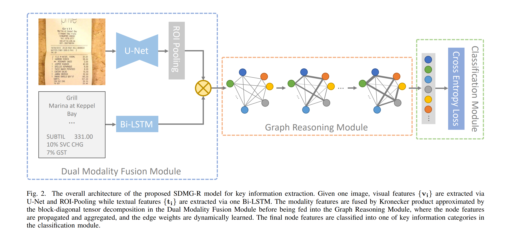

在上篇文章[关键信息提取网络SDMGR代码详解(2): 数据处理与主干网络](/paddle-ocr-kie-sdmgr-code-data-process-and-backbone)中我们结合代码介绍了[PaddleOCR](https://github.com/PaddlePaddle/PaddleOCR)中用于关键信息提取(KIE)任务网络[SDMGR](https://arxiv.org/abs/2103.14470v1)(Spatial Dual-Modality Graph Reasoning for Key Information Extraction)的主干网络部分。今天我们了解对文字部分处理的循环神经网络LSTM与融合多模态特征后进行图推理的图神经网络模块。而这两个模块也是SDMGR网络中最重要也是最复杂的模块。



这两部分的代码都位于`ppocr/modeling/heads/kie_sdmgr_head.py`。

# 1. 文字嵌入(Embedding)
在经过数据预处理和主干网络后，批量中每一条数据的文字部分都被处理成了一个[num\_nodes, recoder\_len]大小的矩阵。其中`num_nodes`代表了这条数据中一共有多少个文字节点，而`recoder_len`则表示了这条数据的所有文字记录中，最长的那条文字的长度。对于长度不足`recoder_len`的文字，则用`-1`补齐到`recoder_len`的长度。现在每条文字对应的数组中，除了padding所用的-1外，其余的元素均使用字典将文字转换到了`float32`格式的数字标号。而为了能使得LSTM能够处理这些文字信息，仍然需要将这些`float32`格式的数字标号转换为长度固定的数组表示，也就是说需要完成文字的嵌入。
```python
relations, texts, x = input
node_nums, char_nums = [], []
for text in texts:
    # text.shape[0]获取了一条数据中文字节点的数量
    # node_nums则记录了一个batch中所有数据的文字节点数量，形状为[batch_size]
    node_nums.append(text.shape[0])
    # 计算每条文字去除padding后的长度，形成形状为[num_nodes]的数组
    # char_nums形状为[batch_size, num_nodes]，记录了每个batch各个文字的真实长度
    char_nums.append(paddle.sum((text > -1).astype(int), axis=-1))

# max_num计算出了当前所有batch中最长的文字长度, shape为[1]。仅包含一个元素
max_num = max([char_num.max() for char_num in char_nums])
# 首先看内层，将每个批量中text([num_nodes, recoder_len])与一个全0矩阵([num_nodes, max_num - recoder_len])在最后一个维度拼接
# 其实就是用全0矩阵将text pad成[num_nodes, max_num]的形状，使得整个批量的所有文字在长度维都固定为max_num
# 最终将批量内所有的文字在第一维也就是num_nodes维度拼接
# 形成all_nodes，形状为[all_num_nodes, max_num]
all_nodes = paddle.concat([
    paddle.concat(
        [text, paddle.zeros(
            (text.shape[0], max_num - text.shape[1]))], -1)
    for text in texts
])
# 最小值限定为0，将残余的-1 padding去除
temp = paddle.clip(all_nodes, min=0).astype(int)
# 进行批量整体的词嵌入
embed_nodes = self.node_embed(temp)
```
从代码中我们可以得知，在真正的Embedding之前，需要将当前批量中所有的文字信息合并到一起，形成一个形状为`[all_num_nodes, max_num]`的矩阵，其中`all_num_nodes`是当前批量中所有文字信息的总数，`max_num`是这些文字中最长的长度。那些较短的文字与`max_num`之间的差距都用`0`做Padding。

其中嵌入层的定义为
```python
self.node_embed = nn.Embedding(num_chars, node_input, 0)
```
`num_chars`为字典的长度，而`node_input`是一个超参数(默认为32)，即每个词嵌入后的数组长度。第三个参数`padding_idx=0`表示所有的`0`都只是用作Padding的。
经过Embedding后，每个字符都从单个数字被展开为了长度为`node_input`的向量。最终输入到LSTM中的文字矩阵形状为`[all_num_nodes, max_num, node_input]`。

# 2. 循环神经网络LSTM

[LSTM](https://en.wikipedia.org/wiki/Long_short-term_memory)(Long short-term memory)即长短期记忆是在RNN的基础上增加了一个新的传输状态`c(t)`(cell state)，与原有的传输状态`h(t)`共同组成了长期和短期的记忆。关于LSTM详细的技术细节这里不再赘述，对于每一个时间步`t`的输入`x(t)`，LSTM输出一个隐变量`h(t)`。SDMGR也是利用这个机制，把LSTM当作了对文字信息的编码器使用。


我们先来看LSTM的初始化
```python
hidden = node_embed // 2 if bidirectional else node_embed
self.rnn = nn.LSTM(
    input_size=node_input, hidden_size=hidden, num_layers=1)
```
这里直接使用了Paddle对LSTM的实现，传入的参数分别为
- input_size=node_input: 决定了输入`x(t)`的形状。`node_input`作为超参数决定了词嵌入后每个字符对应的向量长度，也决定了LSTM的输入形状。
- hidden_size=hidden：`node_embed`也是一个超参数，决定了LSTM隐藏层的大小以及输出向量的长度。这里`node_embed`默认为256，如果模型选择了双向`bidirectional=true`则隐藏层大小会减半，但实际并未将LSTM变为双向LSTM。
- num_layers=1：LSTM的层数固定为1

将上一步嵌入完成的文字输入LSTM网络即可得到编码完成的文字特征`rnn_nodes`，形状为[all_num_nodes, max_num, hidden_size]。即将上一步得到的`embed_nodes`的最后一个维度从`node_input`变为了`hidden_size`, `hidden_size`默认为256。
```python
rnn_nodes, _ = self.rnn(embed_nodes)
```

LSTM输出的结果包含了各个node文字序列中，每一个时间步的输出。但对于SDMGR来说，仅仅需要获得整句句子总体的特征。所以需要把这个结果中除了最后一个元素的隐状态输出外的其他结果全部去掉。
```python
# b: all_num_nodes
# h: max_num
# w: hidden_size
b, h, w = rnn_nodes.shape
# 所有的node，形状为[all_num_nodes, hidden_size]
nodes = paddle.zeros([b, w])
# 一维数组，批量中所有文字的长度，该数组长度为批量中所有节点的个数，即all_num_nodes
all_nums = paddle.concat(char_nums)
# 获取长度不为0的文字index，shape为[all_num_nodes, 1]
valid = paddle.nonzero((all_nums > 0).astype(int))
# (paddle.gather(all_nums, valid) - 1) 先将所有不为0的长度挑选出来，并且长度 -1
# 经过两次unsqueeze，temp_all_nums的形状变为了[all_num_nodes, 1, 1]
temp_all_nums = (
    paddle.gather(all_nums, valid) - 1).unsqueeze(-1).unsqueeze(-1)
# temp_all_nums形状变为了[all_num_nodes, 1, hidden_size]， hidden_size=256，最后一维即文字长度被复制了256次
temp_all_nums = paddle.expand(temp_all_nums, [
    temp_all_nums.shape[0], temp_all_nums.shape[1], rnn_nodes.shape[-1]
])
# temp_all_nodes的形状不变，维持与rnn_nodes相同，剔除了文字长度为1的节点
temp_all_nodes = paddle.gather(rnn_nodes, valid)
# N: all_num_nodes - 批量中所有节点个数
# C: max_num - 所有文字中最长的长度
# A: hidden_size - RNN隐藏层大小，默认256
N, C, A = temp_all_nodes.shape
# one_hot为对各node按照C=max_num进行独热编码
# 即按照文字的长度进行分类
# 独热编码后交换第二第三维顺序，整体shape变为与temp_all_nodes相同的[all_num_nodes, max_num, hidden_size]
# 第二维大小max_num即独热编码后的向量, 第三维hidden_size为全0或者全1
one_hot = F.one_hot(
    temp_all_nums[:, 0, :], num_classes=C).transpose([0, 2, 1])
# 将RNN的输出temp_all_nodes与形状相同的独热编码one_hot按元素相乘
# 因为one_hot的第三维为全0或者全1，RNN每个元素的输出multiply后仅保留了序列中最后一个元素的输出
# 在第一维求和后，因为除了最后一个元素输出其他全为0，所以得到形状为[all_num_nodes, 1, hidden_size]
# 每个node对应文字序列的最后一个字的RNN输出
one_hot = paddle.multiply(
    temp_all_nodes, one_hot.astype("float32")).sum(axis=1, keepdim=True)
# 去掉中间，RNN输出shape变为[all_num_nodes, hidden_size]
t = one_hot.expand([N, 1, A]).squeeze(1)
# valid.squeeze(1)是一个shape为[all_num_nodes]的mask，用于过滤长度为0的node
# 最终，RNN的隐藏层保留了序列中最后一个元素的输出，并且过滤掉了成都为0的node
nodes = paddle.scatter(nodes, valid.squeeze(1), t)
```

整个流程的计算相对比较复杂，结合代码我们可以知道从长短不一的RNN输出中挑选出最后一个元素的输出，这里巧妙地使用了独热编码：

> 例如假设全体文字最长地长度`max_num`为3，那么1, 2, 3就会被分别编码为向量[1, 0, 0], [0, 1, 0] 和 [0, 0, 1]。
> 不用考虑0是因为长度为0的节点在这是已经被剔除了。
> 那么实际长度为2的序列[11, 12]由于被padding到了长度max_num=3，就成为了[11, 12, 0]。
> 此时想要获得实际长度的最后一个元素12，那就可以先对长度2进行num_classes=3的独热编码获得[0, 1, 0]，然后与向量[11, 12, 0]按元素乘积再累加，就可以获得元素12了。

看起来相当繁琐，但对于比较大的矩阵来说，这样的操作可以通过数次矩阵运算，轻松地计算出所有节点地输出。最终LSTM的输出形状为`[all_num_nodes, hidden_size]`。

# 3. 特征融合

到现在为止，我们以及得到了每个文字对应的图片特征以及每个文字的特征，接下来我们就可以将文字特征与图片特征融合在一起了。

```python
self.fusion = Block([visual_dim, node_embed], node_embed, fusion_dim)
# x即经过ROI后的图片特征图
# x的shape为[all_num_nodes, 16]，即所有节点对应的16维通道特征
# 输出的shape与文字节点shape保持一致，为[all_num_nodes, hidden_size]
if x is not None:
    nodes = self.fusion([x, nodes])
```
从调用就能看出这里将图片信息x与文字信息nodes融合。如果不存在图片，模型也可以单纯使用文字。

SDMGR使用了[克罗内克积](https://zh.m.wikipedia.org/zh/%E5%85%8B%E7%BD%97%E5%86%85%E5%85%8B%E7%A7%AF)来融合两个特征。克罗内克积是外积从向量到矩阵的推广：


可以看到克罗内克积的结果是一个分块矩阵，[m, a]矩阵与[n, b]矩阵德克罗内克积形状是[m\*n, a\*b]。直白地理解就是左侧矩阵中的每个元素与右侧矩阵相乘，获得的结果形状与右侧矩阵相同，放置于结果中左侧矩阵的相对位置。举个例子：


SDMGR使用的克罗内克积基于计算复杂度的考虑进行了修改。输入x与nodes会分别通过一个全连接层统一变成shape为[all_num_nodes, 1024]的矩阵。经过一系列修改版的克罗内克积的操作后仍然保持了[all_num_nodes, 1024]，最后通过一个全连接层转换为[all_num_nodes, hidden_size]的矩阵输出。

克罗内克积在物理中经常使用，但在机器学习领域不常出现。SDMGR的改版克罗内克积详细过程这里不在赘述。

# 4. 图神经网络GNN

SDMGR的一大亮点就是使用图神经网络来处理节点与空间信息。在上面的特征融合后我们得到了构成图神经网络中节点的一部分，接下来就要开始基于空间信息构造边了。

```python
# relations的shape为[batch_size, num_nodes, num_nodes, 5], 记录了每条数据中边缘框与边缘框之间的关系
# 将batch中所有的relation拼接起来后，形成了all_edges, shape为[num_nodes*num_nodes*n, 5]
all_edges = paddle.concat(
    [rel.reshape([-1, rel.shape[-1]]) for rel in relations])
# edge_embed是一个全连接层，将5维的空间信息扩展为256维
embed_edges = self.edge_embed(all_edges.astype('float32'))
# 对embed_edges做L2 norm
embed_edges = F.normalize(embed_edges)
```

经过一个全连接和L2范数归一化后，我们获得了空间信息特征，形状为[num_nodes\*num_nodes\*n, 256]，就可以进行图神经网络迭代了
```python
for gnn_layer in self.gnn_layers:
    nodes, cat_nodes = gnn_layer(nodes, embed_edges, node_nums)
```
重新回顾一下各个参数：
- nodes：文字与图片信息的融合，shape=[all_num_nodes, hidden_size]
- embed_edges：空间信息，shape=[num_nodes\*num_nodes\*n, 256]
- node_nums：batch中每条数据的节点数，shape=\[batch_size]

默认该迭代会重复两次，不断更新输出`nodes`与`cat_nodes`，其中`nodes`会作为新的节点特征进入下一次迭代

我们来看一下图神经网络是如何定义前向计算的:
```python
def forward(self, nodes, edges, nums):
    start, cat_nodes = 0, []
    for num in nums:
        # 根据每条数据的节点数，从batch中截取当前数据的所有节点
        # sample_nodes shape = [num_nodes, hidden_size]
        sample_nodes = nodes[start:start + num]
        # sample_nodes.unsqueeze(1) shape = [num_nodes, 1, hidden_size]
        # sample_nodes.unsqueeze(0) shape = [1, num_nodes, hidden_size]
        # 经过expand后这两个变量的shape都变为了[num_nodes, num_nodes, hidden_size]
        # 虽然形状一样但是内容有所区别，一个是在第0维度上从1复制为num_nodes，另一个是在第1维度上复制。
        # reshape后最终的cat_nodes的shepe为[batch_size, num_nodes*num_nodes, hidden_size*2]
        cat_nodes.append(
            paddle.concat([
                paddle.expand(sample_nodes.unsqueeze(1), [-1, num, -1]),
                paddle.expand(sample_nodes.unsqueeze(0), [num, -1, -1])
            ], -1).reshape([num**2, -1]))
        start += num
    # paddle.concat(cat_nodes)后shape为[num_nodes*num_nodes*n, hidden_size*2]，hidden_size默认为256
    # cat_nodes concat了edges后，最终的shape为[num_nodes*num_nodes*n, 768]
    cat_nodes = paddle.concat([paddle.concat(cat_nodes), edges], -1)
    # in_fc是一个全连接，将feature维度产品卖给node_dim * 2 + edge_dim=768降低到node_dim=256
    # 此时cat_nodes shape=[num_nodes*num_nodes*n, 256]
    # cat_nodes代表了节点的特征与两节点间的空间关系
    cat_nodes = self.relu(self.in_fc(cat_nodes))
    # coef_fc是一个全连接，将256维的feature降为1维
    # coefs shape=[num_nodes*num_nodes*n, 1]
    # 而coefs经过归一化后代表了可学习的两个节点间边的权重
    coefs = self.coef_fc(cat_nodes)

    start, residuals = 0, []
    for num in nums:
        # 将coefs还原成[num_nodes, num_nodes, 1]的矩阵，然后每一行做softmax归一化
        # 这里为了让每个节点自己与自己的关系降为0，不影响归一化的结果，在softmax之前在对角线上的元素减去了1e9。
        # residual即学习的两个节点间边的权重
        # residual的shape为[num_nodes, num_nodes, 1]
        residual = F.softmax(
            -paddle.eye(num).unsqueeze(-1) * 1e9 +
            coefs[start:start + num**2].reshape([num, num, -1]), 1)
        # 将边权重与空间特征相乘，获得了每条数据整体的特征，shape为[num_nodes, num_nodes, 256]
        # 在维度1上加和特征，由于系数residual经过归一化，相当于对节点i，计算了与其他节点之间关系特征的加权平均数
        # 最终特征的shape为[num_nodes, 256]
        residuals.append((residual * cat_nodes[start:start + num**2]
                            .reshape([num, num, -1])).sum(1))
        start += num**2

    # 将上述计算获得的特征拼接后经过一层输入和输出维度相等的全连接层，再与nodes相加
    # 相加也说明杉树所学习到的整体特征实际是一个残差值residual
    # 最终输出nodes shape=[num_nodes, 256]，代表节点特征
    # cat_nodes shape=[num_nodes*num_nodes*n, 256]，代表边特征
    nodes += self.relu(self.out_fc(paddle.concat(residuals)))
    return [nodes, cat_nodes]
```
整个图神经网络先将代表节点特征的`nodes`与边特征的`edges`按照每条数据拼接，形成了特征`cat_nodes`，该特征同时包含节点(图片+文字)与空间(边缘框)的特征。随后经过一个输出维度为1的全连接层并归一化，得到了残差系数矩阵(实际是[num_nodes, num_nodes, 1]的张量)`residual`，使用这个系数对某个node`i`计算与其他所有node之间特征的加权和，获得的残差值与输入的节点特征加和并作为新的节点特征输出。整个图神经网络迭代的过程就是不断地叠加这个残差值，使得最终对node的分类逼近真实值。

获得节点特征`nodes`和空间特征`cat_nodes`后，就可以对节点以及边分类了。经过全连接层，把`nodes`的维度从256调整到与分类数一致，cat_nodes的维度从256调整到2
```python
node_cls, edge_cls = self.node_cls(nodes), self.edge_cls(cat_nodes)
return node_cls, edge_cls
```

# 5.总结

今天这篇文章从从代码角度介绍了整个SDMGR网络的词嵌入，循环神经网络，特征融合以及图神经网络部分。下一篇文章会继续介绍损失函数与评估函数。

### 参考链接
1. https://en.wikipedia.org/wiki/Long_short-term_memory
2. https://zh.m.wikipedia.org/zh/%E5%85%8B%E7%BD%97%E5%86%85%E5%85%8B%E7%A7%AF